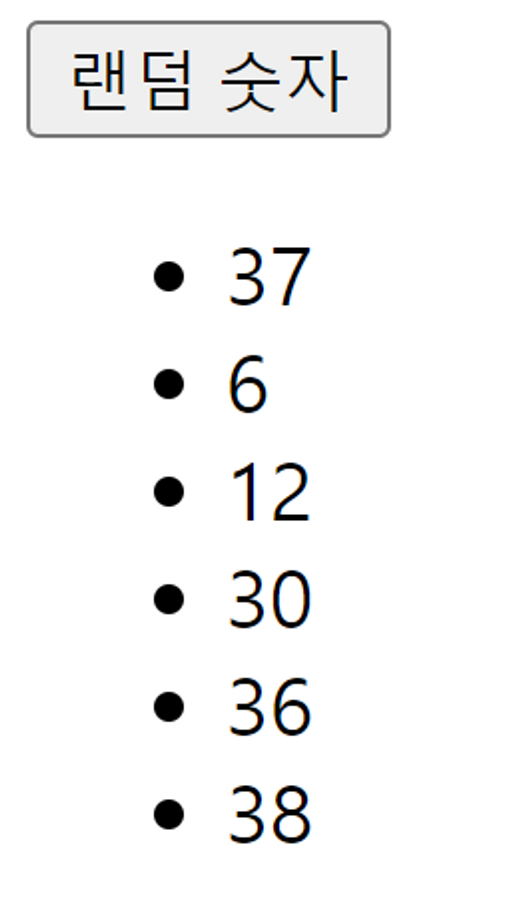

## 문제 1 - useState

### 버튼을 클릭 했을 때 1 ~ 45 사이의 랜덤한 숫자가 List에 출력이 되도록 코드를 작성 해 주세요.

- 조건 1 - useState를 이용하여 List를 관리 해 주세요
- 조건 2 - 함수 컴포넌트만을 이용해서 작성 해 주세요.
- 조건 3 - “랜덤 숫자” 텍스트가 있는 버튼을 클릭하면 아래의 리스트에 출력이 되게 해 주세요.
- 조건 4 - 숫자는 중복되어도 상관 없습니다.

  작성 결과

  

  ```js
  // answer
  const root = ReactDOM.createRoot(document.getElementById("root"));

  function App() {
    const [num, setNum] = React.useState("");
    const [nums, setNums] = React.useState([]);

    const onClick = () => {
      setNum(Math.floor(Math.random() * 45 + 1));
      setNums((value) => [num, ...value]);
    };

    return (
      <div>
        <button onClick={onClick}>랜덤 숫자</button>
        {nums.map((value, index) => (
          <li key={index}>{value}</li>
        ))}
      </div>
    );
  }

  root.render(<App />);
  ```

---

## 문제 2 - useEffect

사수가 코드를 작성하다가 갑자기 몸이 아프다며 반차를 쓰고 도망갔습니다. 아래의 코드가 정상적으로 동작하려면 어떻게 해 주어야 할까요?

### 코드의 의도

- 3초마다 자신의 운에 따라서 로그인이 되고, 안되고를 판단하는 홈페이지입니다.

### 현재 상태

- 파일을 저장 할 때 마다 이벤트가 중복됩니다.
- 값이 변경 될 때 마다 이벤트가 중복됩니다.

### 조건

- useEffect 코드를 삭제하면 말끔히 됩니다! 는 정답이 아닙니다…

```js
// question
const root = ReactDOM.createRoot(document.getElementById("root"));

function TextList(props) {
  return (
    <ul>
      {props.items.map((value, index) => {
        return <li key={index}>{value}</li>;
      })}
    </ul>
  );
}

function App(props) {
  const [isLogin, changeIsLogin] = React.useState(false);

  React.useEffect(() => {
    setInterval(() => {
      const tf = Math.floor(Math.random() * (2 - 0) + 0);
      console.log(tf);
      console.log(!tf ? "로그인 된 상태" : "로그아웃이 필요한 상태");
      changeIsLogin((prevValue) => {
        return !tf;
      });
    }, 3000);
  });

  function click() {
    changeIsLogin((prevValue) => {
      return !prevValue;
    });
  }

  return (
    <div>
      <span>{!isLogin ? "회원가입을 해 주세요!" : "반갑습니다~"}</span>
      <button onClick={click}>{!isLogin ? "로그인" : "로그아웃"}</button>
    </div>
  );
}

root.render(<App />);

// answer
const root = ReactDOM.createRoot(document.getElementById("root"));

function TextList(props) {
  return (
    <ul>
      {props.items.map((value, index) => {
        return <li key={index}>{value}</li>;
      })}
    </ul>
  );
}

function App(props) {
  const [isLogin, changeIsLogin] = React.useState(false);

  React.useEffect(() => {
    const id = setInterval(() => {
      const tf = Math.floor(Math.random() * (2 - 0) + 0);
      console.log(tf);
      console.log(!tf ? "로그인 된 상태" : "로그아웃이 필요한 상태");
      changeIsLogin((prevValue) => {
        return !tf;
      });
    }, 3000);
    return function clear() {
      clearInterval(id);
    };
  });

  function click() {
    changeIsLogin((prevValue) => {
      return !prevValue;
    });
  }

  return (
    <div>
      <span>{!isLogin ? "회원가입을 해 주세요!" : "반갑습니다~"}</span>
      <button onClick={click}>{!isLogin ? "로그인" : "로그아웃"}</button>
    </div>
  );
}

root.render(<App />);
```

---

## 문제 3 - useRef

input값에 기본 값으로 firstList에 들어가 있는 문자를 input의 useRef를 이용하여 설정 할 수 있도록 구현 해 주세요.

- 조건 1. useRef를 써 주세요
- 조건 2. 페이지가 처음 렌더가 되었을 때 input에 홍길동 값이 들어가 있어야 합니다.
- 조건 3. firstValue의 값을 랜덤으로 받아오는 함수는 아래와 같습니다.

```js
firstValue[Math.floor(Math.random() * (firstValue.length - 0) + 0)];
```

```js
// question
const root = ReactDOM.createRoot(document.getElementById("root"));

function App(props) {
  const firstValue = ["홍길동", "김아무개", "이아무개", "최아무개", "박아무개"];

  /* useRef를 써 주세요 */

  React.useEffect(() => {
    /* 빈칸에 알맞은 코드를 입력 해 주세요 */
  });

  return (
    <div>
      <input /* 빈칸에 알맞은 코드를 입력 해 주세요 */ />
    </div>
  );
}

root.render(<App />);

//answer
const root = ReactDOM.createRoot(document.getElementById("root"));

function App(props) {
  const firstValue = ["홍길동", "김아무개", "이아무개", "최아무개", "박아무개"];

  const input = React.useRef(null);
  console.log(input);

  const onClick = () => (input.current.value = firstValue[Math.floor(Math.random() * (firstValue.length - 0) + 0)]);

  React.useEffect(() => {
    input.current.value = firstValue[Math.floor(Math.random() * (firstValue.length - 0) + 0)];
  });

  return (
    <div>
      <input ref={input} onClick={onClick} />
    </div>
  );
}

root.render(<App />);
```

---

## 문제 4 - useMemo

고객 명단을 관리하는 페이지 입니다. 전체적인 코드를 파악하고, useMemo를 이용하여 온라인인 고객만 계산 할 수 있는 함수와 useMemo를 구현 해 주세요.

```js
// question
const root = ReactDOM.createRoot(document.getElementById("root"));

function TextList(props) {
  return (
    <ul>
      {props.items.map((value, index) => {
        return (
          <li key={index}>
            <span>{`이름 : ${value.name}, 상태 : ${
              !value.status ? "로그인" : "로그아웃"
            }`}</span>
            {!value.status ? (
              <button
                onClick={() => {
                  props.reStatus(index);
                }}
              >
                로그아웃 시키기
              </button>
            ) : (
              <button
                onClick={() => {
                  props.reStatus(index);
                }}
              >
                로그인 시키기
              </button>
            )}
          </li>
        );
      })}
    </ul>
  );
}

function TextArea(props) {
  return (
    <div>
      <span>{`현재 온라인 한 고객의 수는 ${props.count}명 입니다.`}</span>
    </div>
  );
}

function InputArea(props) {
  return (
    <div>
      <input type="text" onChange={props.change} value={props.value} />
      <button onClick={props.add}>추가</button>
    </div>
  );
}

function App(props) {
  const user = [
    {
      id: 0,
      name: "홍길동",
      status: true,
    },
    {
      id: 1,
      name: "김아무개",
      status: false,
    },
    {
      id: 2,
      name: "이아무개",
      status: true,
    },
    {
      id: 3,
      name: "최아무개",
      status: false,
    },
    {
      id: 4,
      name: "박아무개",
      status: true,
    },
  ];

  const [users, changeUsers] = React.useState(user);
  const [value, changeValue] = React.useState("");

  const addUser = () => {
    changeUsers([
      ...users,
      { id: user.length, name: value, status: "online" },
    ]);
    changeValue("");
  };

  const reValue = (e) => {
    changeValue(e.target.value);
  };

  const reStatus = (index) => {
    changeUsers(
      users.map((user) =>
        user.id === index ? { ...user, status: !user.status } : user
      )
    );
  };

  const countOnline = () => {
    console.log("이게 반복 됩니다.");
    return users.filter((user) => user.status === true).length;
  };

  const memo = /* 알맞은 useMemo를 입력 해 주세요 */

  return (
    <React.Fragment>
      <InputArea value={value} change={reValue} add={addUser} />
      <TextArea count={memo} />
      <TextList items={users} reStatus={reStatus} />
    </React.Fragment>
  );
}

root.render(<App />);


// answer
const root = ReactDOM.createRoot(document.getElementById("root"));

function TextList(props) {
  return (
    <ul>
      {props.items.map((value, index) => {
        return (
          <li key={index}>
            <span>{`이름 : ${value.name}, 상태 : ${!value.status ? "로그인" : "로그아웃"}`}</span>
            {!value.status ? (
              <button
                onClick={() => {
                  props.reStatus(index);
                }}
              >
                로그아웃 시키기
              </button>
            ) : (
              <button
                onClick={() => {
                  props.reStatus(index);
                }}
              >
                로그인 시키기
              </button>
            )}
          </li>
        );
      })}
    </ul>
  );
}

function TextArea(props) {
  return (
    <div>
      <span>{`현재 온라인 한 고객의 수는 ${props.count}명 입니다.`}</span>
    </div>
  );
}

function InputArea(props) {
  return (
    <div>
      <input type="text" onChange={props.change} value={props.value} />
      <button onClick={props.add}>추가</button>
    </div>
  );
}

function App(props) {
  const user = [
    {
      id: 0,
      name: "홍길동",
      status: true,
    },
    {
      id: 1,
      name: "김아무개",
      status: false,
    },
    {
      id: 2,
      name: "이아무개",
      status: true,
    },
    {
      id: 3,
      name: "최아무개",
      status: false,
    },
    {
      id: 4,
      name: "박아무개",
      status: true,
    },
  ];

  const [users, changeUsers] = React.useState(user);
  const [value, changeValue] = React.useState("");

  const addUser = () => {
    changeUsers([...users, { id: user.length, name: value, status: "online" }]);
    changeValue("");
  };

  const reValue = (e) => {
    changeValue(e.target.value);
  };

  const reStatus = (index) => {
    changeUsers(users.map((user) => (user.id === index ? { ...user, status: !user.status } : user)));
  };

  const countOnline = () => {
    console.log("이게 반복 됩니다.");
    return users.filter((user) => user.status === true).length;
  };

  const memo = React.useMemo(() => {
    return countOnline();
  }, [users]);

  return (
    <React.Fragment>
      <InputArea value={value} change={reValue} add={addUser} />
      <TextArea count={memo} />
      <TextList items={users} reStatus={reStatus} />
    </React.Fragment>
  );
}

root.render(<App />);
```

---

## 문제 5 - 최댓값 만들기.

문제 설명
정수 배열 `numbers`가 매개변수로 주어집니다. `numbers`의 원소 중 두 개를 곱해 만들 수 있는 최댓값을 return하도록 solution 함수를 완성해주세요.

```js
// answer
const solution = (numbers) => {
  numbers.sort((b, a) => a - b);
  return (answer = numbers[0] * numbers[1]);
};

console.log(solution([0, 31, 24, 10, 1, 9]));
```

---

## 문제 6 - 모스부호

### 문제 설명

머쓱이는 친구에게 모스부호를 이용한 편지를 받았습니다. 그냥은 읽을 수 없어 이를 해독하는 프로그램을 만들려고 합니다. 문자열 `letter`가 매개변수로 주어질 때, `letter`를 영어 소문자로 바꾼 문자열을 return 하도록 solution 함수를 완성해보세요.모스부호는 다음과 같습니다.

```js
morse = {
  ".-": "a",
  "-...": "b",
  "-.-.": "c",
  "-..": "d",
  ".": "e",
  "..-.": "f",
  "--.": "g",
  "....": "h",
  "..": "i",
  ".---": "j",
  "-.-": "k",
  ".-..": "l",
  "--": "m",
  "-.": "n",
  "---": "o",
  ".--.": "p",
  "--.-": "q",
  ".-.": "r",
  "...": "s",
  "-": "t",
  "..-": "u",
  "...-": "v",
  ".--": "w",
  "-..-": "x",
  "-.--": "y",
  "--..": "z",
};
```

```js
// answer
const solution = (letter) => {
  morse = {
    ".-": "a",
    "-...": "b",
    "-.-.": "c",
    "-..": "d",
    ".": "e",
    "..-.": "f",
    "--.": "g",
    "....": "h",
    "..": "i",
    ".---": "j",
    "-.-": "k",
    ".-..": "l",
    "--": "m",
    "-.": "n",
    "---": "o",
    ".--.": "p",
    "--.-": "q",
    ".-.": "r",
    "...": "s",
    "-": "t",
    "..-": "u",
    "...-": "v",
    ".--": "w",
    "-..-": "x",
    "-.--": "y",
    "--..": "z",
  };

  return letter
    .split(" ")
    .map((value) => morse[value])
    .join("");
};

console.log(solution(".... . .-.. .-.. ---")); //hello
```
