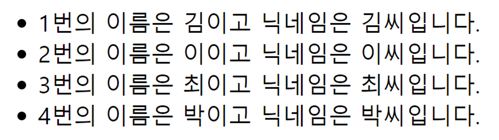

## 문제 1 - for문

아래의 배열을 for문을 이용해서 2배로 늘려주세요.

```js
// question
const array = [1,2,3,4,5]
const array2 = []
for(/* 빈칸을 채워주세요 */) {
	/* 빈칸을 채워주세요 */
}


// answer
const array = [1, 2, 3, 4, 5];
const array2 = [];
for (let i = 0; i < array.length; i++) {
  array2[i] = array[i] * 2;
}
console.log(array2); // [ 2, 4, 6, 8, 10 ]
```

---

## 문제 2 - forEach문

아래의 배열을 forEach문을 이용해서 2배로 늘려주세요.

```js
// question
const array = [1, 2, 3, 4, 5];
const array2 = [];
array.forEach(/* 빈칸을 채워주세요 */);


// answer
const array = [1, 2, 3, 4, 5];
let array2 = [];
array.forEach((value) => {
array2.push(value \* 2);
});
console.log(array2); //[ 2, 4, 6, 8, 10 ]
```

---

## 문제 3 - map

아래의 배열을 map을 이용해서 2배로 늘려주세요.

```js
// question
const array = [1, 2, 3, 4, 5];
const array2 = [];
array2 = array.map(/* 빈칸을 채워주세요 */);

// answer
const array = [1, 2, 3, 4, 5];
const array2 = array.map((value) => value * 2);

console.log(array2); //[ 2, 4, 6, 8, 10 ]
```

---

## 문제 4 - for문

아래의 배열을 for문을 이용해서 li로 만들어주세요.

```js
// question
const array = ["일어나기", "씻기", "커피사기", "출근하기", "일하기", "점심먹기", "일하기", "퇴근하기"]
const array2 = []
for(/* 빈칸을 채워주세요 */) {
	/* 빈칸을 채워주세요 */
}

// answer
const array = ["일어나기", "씻기", "커피사기", "출근하기", "일하기", "점심먹기", "일하기", "퇴근하기"];
const array2 = [];
for (let i = 0; i < array.length; i++) {
  array2[i] = <li>{array[i]}</li>;
}
```

---

## 문제 5 - forEach문

아래의 배열을 forEach문을 이용해서 li로 만들어주세요.

```js
// question
const array = ["일어나기", "씻기", "커피사기", "출근하기", "일하기", "점심먹기", "일하기", "퇴근하기"];
const array2 = [];
array.forEach(/*빈칸을 채워주세요*/);

// answer
const array = ["일어나기", "씻기", "커피사기", "출근하기", "일하기", "점심먹기", "일하기", "퇴근하기"];
const array2 = [];
array.forEach((value) => {
  array2.push(<li>{value}</li>);
});
```

---

## 문제 6 - map

아래의 배열을 map을 이용해서 li로 만들어주세요.

```js
// question
const array = ["일어나기", "씻기", "커피사기", "출근하기", "일하기", "점심먹기", "일하기", "퇴근하기"];
const array2 = array.map(/*빈칸을 채워주세요.*/);

// answer
const array = ["일어나기", "씻기", "커피사기", "출근하기", "일하기", "점심먹기", "일하기", "퇴근하기"];
const array2 = array.map((value) => <li>{value}</li>);
```

---

## 문제 7 - for문

아래의 배열을 for문을 이용해서 함수 컴포넌트에 값을 채워 주세요.

```js
//question
const root = ReactDOM.createRoot(document.getElementById("root"));
const array = [
  { id: "1", name: "김", nick: "김씨" },
  { id: "2", name: "이", nick: "이씨" },
  { id: "3", name: "최", nick: "최씨" },
  { id: "4", name: "박", nick: "박씨" },
];

function ClientList(props) {
  return <ul>{props.clientList}</ul>;
}
const array2 = [];
for (/*빈칸을 채워주세요.*/){/*빈칸을 채워주세요.*/}

root.render(<ClientList /* 빈칸을 채워주세요. *//>);


// answer
const root = ReactDOM.createRoot(document.getElementById("root"));
const array = [
  { id: "1", name: "김", nick: "김씨" },
  { id: "2", name: "이", nick: "이씨" },
  { id: "3", name: "최", nick: "최씨" },
  { id: "4", name: "박", nick: "박씨" },
];

function ClientList(props) {
  return <ul>{props.clientList}</ul>;
}
const array2 = [];
for (let i = 0; i < array.length; i++) {
  array2[i] = <li>{`${array[i].id}번의 이름은 ${array[i].name}이고 닉네임은 ${array[i].nick}입니다`}</li>;
}

root.render(<ClientList clientList={array2} />);
```

---

## 문제 8 - forEach문

아래의 배열을 forEach문을 이용해서 li로 만들어주세요. 다음과 같이 출력됩니다.


```js
// question
const root = ReactDOM.createRoot(document.getElementById("root"));
const array = [
  { id: "1", name: "김", nick: "김씨" },
  { id: "2", name: "이", nick: "이씨" },
  { id: "3", name: "최", nick: "최씨" },
  { id: "4", name: "박", nick: "박씨" },
];

function ClientList(props) {
  return <ul>{props.clientList}</ul>;
}
const array2 = [];
array.forEach(/* 빈칸을 채워주세요 */);

root.render(<ClientList /* 빈칸을 채워주세요. */ />);

//answer
const root = ReactDOM.createRoot(document.getElementById("root"));
const array = [
  { id: "1", name: "김", nick: "김씨" },
  { id: "2", name: "이", nick: "이씨" },
  { id: "3", name: "최", nick: "최씨" },
  { id: "4", name: "박", nick: "박씨" },
];
function ClientList(props) {
  return <ul>{props.clientList}</ul>;
}
const array2 = [];
array.forEach((value) => {
  array2.push(<li>{`${value.id}번의 이름은 ${value.name}이고 닉네임은 ${value.nick}입니다.`}</li>);
});
root.render(<ClientList clientList={array2} />);
```

---

## 문제 9 - map

아래의 배열을 map을 이용해서 li로 만들어주세요. 다음과 같이 출력됩니다.


```js
// question
const root = ReactDOM.createRoot(document.getElementById("root"));
const array = [
  { id: "1", name: "김", nick: "김씨" },
  { id: "2", name: "이", nick: "이씨" },
  { id: "3", name: "최", nick: "최씨" },
  { id: "4", name: "박", nick: "박씨" },
];

function ClientList(props) {
  return <ul>{props.clientList}</ul>;
}
const array2 = array.map(/* 빈칸을 채워주세요 */);

root.render(<ClientList /* 빈칸을 채워주세요. */ />);

// answer
const root = ReactDOM.createRoot(document.getElementById("root"));
const array = [
  { id: "1", name: "김", nick: "김씨" },
  { id: "2", name: "이", nick: "이씨" },
  { id: "3", name: "최", nick: "최씨" },
  { id: "4", name: "박", nick: "박씨" },
];

function ClientList(props) {
  return <ul>{props.clientList}</ul>;
}
const array2 = array.map((value) => {
  return <li>{`${value.id}번의 이름은 ${value.name}이고 닉네임은 ${value.nick}입니다.`}</li>;
});

root.render(<ClientList clientList={array2} />);
```

---

## 문제 10 - map + 조건부 렌더링

다음 코드 중 id가 1인 “김씨”만 li에 추가하도록 코드를 구현 해 주세요.

```js
// question
const root = ReactDOM.createRoot(document.getElementById("root"));
const array = [
  { id: "1", name: "김", nick: "김씨" },
  { id: "2", name: "이", nick: "이씨" },
  { id: "3", name: "최", nick: "최씨" },
  { id: "4", name: "박", nick: "박씨" },
];

function ClientList(props) {
  return <ul>/* 빈칸을 채워주세요. */</ul>;
}
const array2 = array.map(/* 빈칸을 채워주세요 */);

root.render(<ClientList /* 빈칸을 채워주세요. */ />);

// answer
const root = ReactDOM.createRoot(document.getElementById("root"));
const array = [
  { id: "1", name: "김", nick: "김씨" },
  { id: "2", name: "이", nick: "이씨" },
  { id: "3", name: "최", nick: "최씨" },
  { id: "4", name: "박", nick: "박씨" },
];

function ClientList(props) {
  return <ul>{props.arr}</ul>;
}
const array2 = array.map((value) => {
  return value.id === "1" ? <li>{`${value.id}번의 이름은 ${value.name}이고 닉네임은 ${value.nick}입니다.`}</li> : null;
});

root.render(<ClientList arr={array2} />);
```

---

## 문제 11 - 특정 문자 제거하기

### 문제 설명

문자열 `my_string`과 문자 `letter`이 매개변수로 주어집니다. `my_string`에서 `letter`를 제거한 문자열을 return하도록 solution 함수를 완성해주세요.

```js
// answer
const solution = (my_string, letter) => {
  let array = my_string.split("");
  for (let i = array.length - 1; i >= 0; i--) {
    if (array[i] === letter) {
      array.splice(i, 1);
    }
  }
  return (answer = array.join(""));
};
console.log(solution("abcde", "f")); //abcde
```

---

## 문제 12 - 배열 원소의 길이

### 문제설명

문자열 배열 `strlist`가 매개변수로 주어집니다. `strlist` 각 원소의 길이를 담은 배열을 retrun하도록 solution 함수를 완성해주세요.

```js
// answer1
function solution1(strlist) {
  var answer = strlist.map((value) => {
    return value.length;
  });
  return answer;
}
console.log(solution(["We", "are", "the", "world!"]));

// answer2
function solution2(strlist) {
  return strlist.map((v) => v.length);
}
console.log(solution(["We", "are", "the", "world!"]));
```
