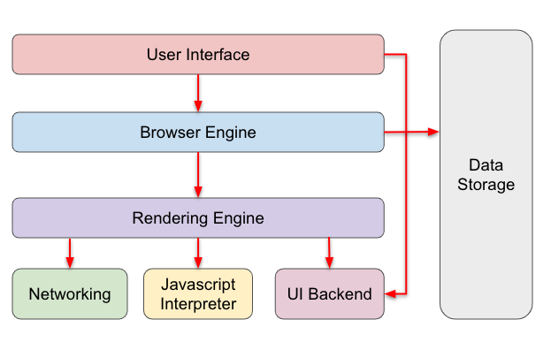

# Javascript 기본

---

## Javascript의 시작

### 자바스크립트의 특징

- 정적인 HTML을 동적으로 표현하기 위해서 만들어진 프로그래밍 언어이다.
- 자바스크립트는 HTML, CSS 와 함께 웹을 구성하는 요소 중 하나이다.
- 웹 브라우저에서 동작하는 유일한 프로그래밍 언어
- 개발자가 별도로 컴파일 작업을 하지 않아도 되는 인터프리터 언어이다.
- 명령형, 함수형, 프로토타입 기반 객제지향 프로그래밍을 지원하는 멀티 패러다임 프로그래밍 언어이다.(ES6부터 클래스도 지원)
- 재밌다.

### 크로스 브라우징 이슈

- 브라우저에 따라 웹 페이지가 정상적으로 동작하지 않는 현상
- 자바스크립트의 표준화의 시작은 1997년 ES1의 시작이었고 단계를 거치며 가장 큰 변화를 가져온 2015년 let/const, 화살표 함수, 클래스, 모듈 등의 기능들이 추가되며 ES6가 공개되었다.
- ES6가 공개된 이후 매 년마다 작은 기능들이 추가되는 식으로 버전 공개를 할 것으로 예고되었다.

### ES6의 브라우저 지원 범위

- 거의 대부분의 브라우저들은 ES6를 지원하고 있지만 internet Explorer나 구형 브라우저는 대부분 ES6를 지원하지 않는다.
- internet Explorer나 구형 브라우저에서도 작동이 되기 위해 bable과 같은 트랜스 파일러를 사용하여 ES6로 구현한 소스코드를 ES5 이하의 버전으로 다운그레이드를 시켜준다. 또 ES6에 도입된 import/export로 프로젝트에 모듈을 도입하기 위해 Webpack을 이용한다.

---

## 브라우저 동작 원리

### 브라우저란?

- 웹 브라우저는 동기적으로 HTML, CSS, javascript 언어를 해석해서 그 내용을 화면에 보여주는 응용 소프트웨어이다.
- 웹 브라우저 종류는 다양하다. 크롬, 사파리, 파이어폭스 등등

### 브라우저의 구조



1. 사용자 인터페이스
   - 사용자가 접근할 수 있는 영역, 요청한 페이지를 보여주는 창을 제외한 나머지이다.
2. 브라우저 엔진
   - 사용자 인터페이스와 렌더링 엔진 사이의 동작을 제어하는 역할이다. 자료 저장소를 참조하여 다양한 작업을 한다.
3. 렌더링 엔진
   - 웹 서버로부터 응답을 받은 것들을 웹 브라우저에 나타내는 역할이다.
   - 브라우저가 서버로부터 HTML 문서를 응답받고 렌더링 엔진의 HTML, CSS 파서로 인해서 파싱 되어서 DOM, CSSOM로 변환해서 렌더 트리로 결합한다. 이 렌더 트리를 기반으로 브라우저에 웹페이지가 나타나게 되는 것이다.
4. 통신
   - 서버와 통신이 가능하게 하는 네트워크 호출에 사용
5. UI 백엔드
   - 기본적인 위젯을 그리는 인터페이스
6. 자바스크립트 해석기(엔진)
   - 자바스크립트 코드를 해석하고 실행한다. 각 브라우저마다 다른 엔진을 사용한다. 주로 대중적으로 구글의 V8 엔진이 있다.
7. 자료 저장소
   - Cookie, Local Storage 등 데이터를 저장

### 렌더링 엔진의 동작 과정

1. HTML 파서로 HTML 문서를 파싱 하여 DOM(Document Object Model) 트리 구축
2. CSS 파서로 CSS 파일을 파싱 하여 CSSOM(CSS Object Model) 생성
3. DOM + CSSOM 렌더 트리를 구축
4. 렌더 트리를 배치(레이아웃) 렌더 트리는 위치와 크기를 가지고 있지 않다. 어느 공간에 위치해야 할지 각 객체들에게 position과 size를 결정해 준다.
5. 렌더 트리를 그린다. 레이아웃 구성이 완료되면 UI 백엔드가 동작하여 각 객체를 화면의 px 값으로 나타내준다.

### 자바스크립트 엔진

- Javascript도 렌더링 엔진에서 처리가 되는가??? 대답은 NO !
- Javascript는 Javascript 엔진이 처리한다.
- 자바스크립트 엔진의 동작 과정
  1. HTML 파서가 DOM 생성 중에 `<script>`태그를 만나게 된다.
  2. Javascript 코드를 실행하기 위해 DOM 생성 프로세스를 중지한다.
  3. javascript 엔진에게 권한을 넘겨준다. (펜 없는 친구에게 펜을 넘겨주듯)
  4. 펜을 넘겨받은 Javascript 엔진은 자신의 파일을 로드하여 파싱하고 실행한다.
  5. 할 일을 다한 Javascript 엔진은 다시 HTML 파서에게 펜은 돌려주고 HTML 파서는 아까 중지했던 시점으로 돌아가 DOM 생성을 재개한다.
- 여기서 알아할 중요한 부분은 Javascript 엔진에게 제어 권한이 있을 때 완성되지 않은 DOM을 조작하게 되면 에러가 발생할 것이다. 이래서 HTML 파일에 Javascript 코드를 `<body>`태그 맨 하단에 위치시키는 이유이다. 즉 HTML DOM 트리가 생성이 된 후 javascript 엔진이 파싱하고 실행하는 것이다.

---

## 자바스크립트의 기본 문법

### 1. 변수 (Variable)

- 변수(Variable)은 값(value)을 할당(저장)하고 그 할당된 값을 참조하기 위해서 사용하는 것이다. 한 번 쓰고 버리는 값이 아니고 유지가 될 필요가 있는 값은 변수에 담아서 사용한다.
  또 변수 이름을 통해서 이 값이 무엇을 의미 하는지 명확히 알 수 있어서 코드의 가독성이 좋아진다.

```js
let a; // 변수 선언
a = 5; // 변수에 값을 할당
```

### 2. 변수의 키워드 (Keyword)

- Javascript에서는 var,let,const의 3가지 키워드로 변수 선언이 가능하다.
  - 3가지의 키워드의 차이점들
    1. var : 변수 중복선언 가능, 함수 레벨 스코프, 변수 Hoisting
    2. let : 변수 중복선언 금지, 블록 레벨 스코프, 변수 Hoisting이 발생 안 하는거 처럼 동작을 함
    3. const : 선언과 동시에 초기화 필요, 재할당 안됨, 상수로 작동됨, 변수명을 대문자로 하는 관례가 있음, 변수 Hoisting이 발생 안 하는거처럼 동작을 함
- 변수 Hoisting 이란? (Hoisting 사전적 정의 : 끌어 올리기)
  - 자바스크립트 함수는 실행이 되기 전에 함수 안에 필요한 변수값들을 전부 모아서 유효범위(함수 블록 `{}` 안) 최상단에 선언을한다
    1. 자바스크립트 파서가 함수 실행 전 해당 함수를 쭉 한 번 훑는다.
    2. 함수 안에 존재하는 변수/함수선언에 대한 정보를 기억하고 있다가 실행한다.
- 즉, 함수 내에서 존재하는 변수 중 필요한 값들을 끌어올리는 것이다. 실제로 코드가 끌어올려지는 것이 아닌, 자바스크립트 파서의 내부적으로 끌어올려 처리한다.

- var 키워드는 예측불가한 오류가 생길 위험이 매우 커 잘 안쓰고 let, const 위주로 쓰인다.

### 3. 값 (Value)

```js
let str = 'Hello World";
```

str 이라는 이름의 변수를 선언하고 'Hello World' 를 값으로 할당하였다. 이때 'Hello World'는 문자열 타입의 값이다.

자바 스크립트의 모든 값은 데이터 타입을 갖는다. Javascript의 총 7가지 데이터 타입을 보자.

```js
// 숫자 (Number)
let num1 = 10;
let num2 = 10.8;

// 문자 (String)
let string = "Hello"; // 뜨는 'Hello'

// Boolean
let bool1 = true;
let bool2 = false;

// null
let n = null;

// undefined
let bar;
// 변수는 존재하나, 어떠한 값으로도 할당되지 않아 자료형이 정해지지(undefined) 않은 상태

// 객체(Object)
let obj = { name: "kim", gender: "male" };

// 배열(Array)
let array = [1, 2, 3];

// 함수(function)
// 함수표현식
const fun = function () {};

// 함수선언식
function fun() {}

// 화살표함수
const fun = () => {};
```

Javscript는 C나 Java 등 다른 점이 변수를 선언할때 데이터 타입을 미리 정하지 않아도 된다. 즉 변수에 할당된 값의 타입에 의해서 알아서 변수의 타입이 결정된다. 이것을 동적 타이핑이라하고 Javascript가 다른 프로그래밍 언어와 구별되는 특징 중 하나이다.

### 4. 연산자 (Operator)

```js
// 산술 연산자
let a = 5 + 2; // 7
let b = 5 - 2; // 3
let c = 5 * 2; // 10
let d = 6 / 2; // 3
let e = 7 % 2; // 1

// 비교 연산자
let a = 3 > 10; // false
let b = 5 === 5; // true

// 논리 연산자
let a = 5 > 3 && 2 < 4; //true
let b = 5 < 3 || 1 > 5; //false

// 할당 연산자
let color = "red"; // "red"

// 문자열 연결 연산자
let str = "Hello" + "World"; // "Hello World"

// 타입 연산자
let type = typeof "Hi"; // "string"
let type = typeof 4; // "number"

// 인스턴스 생성 연산자
let today = new Date(); // 'Wed Nov 30 2022 16:57:40 GMT+0900 (한국 표준시)'
```
